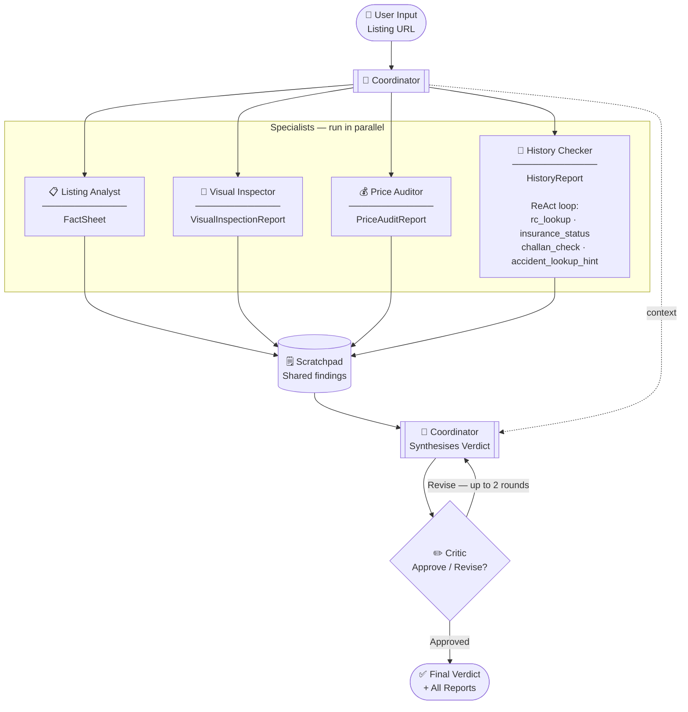

# DealScout

**Multi-agent AI system for used-car listing analysis.**

DealScout takes a used-car listing URL, runs it through a pipeline of five specialist AI agents, and delivers a structured verdict — **Buy**, **Negotiate**, **Investigate**, or **Walk Away** — with supporting evidence, red flags, and a price audit. A Streamlit UI lets you run and review analyses interactively; a CLI mode batch-processes all fixtures in one shot.

---

## How It Works

A **Coordinator** agent receives the listing URL and dispatches four specialists in parallel. Their findings are written to a shared **Scratchpad**. The Coordinator synthesises a **Verdict**, which a **Critic** agent reviews and may send back for revision (up to 2 rounds). Every event is written to a **trace log** in JSONL for full observability.



---

## Agents

| Agent | Role | Output Schema |
|---|---|---|
| **Listing Analyst** | Extracts structured facts from listing text or URL | `FactSheet` |
| **Visual Inspector** | Analyses listing photos for damage, rust, panel mismatches | `VisualInspectionReport` |
| **Price Auditor** | Compares asking price against market band (p25/p50/p75) | `PriceAuditReport` |
| **History Checker** | RC, insurance, challan lookups via internal ReAct tool loop | `HistoryReport` |
| **Coordinator** | Orchestrates all specialists, surfaces disagreements, writes verdict | `Verdict` |
| **Critic** | Reviews the verdict for unsupported claims, miscalibration, overconfidence | `CriticReview` |

> All agent-to-agent communication is **structured JSON** — no free-form prose between agents.

---

## Tech Stack

| Layer | Technology |
|---|---|
| LLM | OpenAI `gpt-4o-mini` via OpenAI Python SDK (structured outputs) |
| Schemas | Pydantic v2 |
| UI | Streamlit |
| Mock RC API | FastAPI + Uvicorn |
| Real URL fetching | Playwright + Firefox |
| HTTP client | httpx |
| Observability | Custom `Scratchpad` + `TraceLogger` (JSONL) |
| Config | python-dotenv |

---

## Project Structure

```
dealscout/
├── agents.py           # All agents and the orchestrate() entry point
├── prompts.py          # System prompts for every agent
├── schemas.py          # Pydantic output schemas (FactSheet, Verdict, etc.)
├── tools.py            # Tool functions + OpenAI-format tool schemas
├── mock_server.py      # FastAPI mock RC lookup server
├── observability.py    # Scratchpad + TraceLogger
├── app.py              # Streamlit UI
├── fixtures/           # Mock listing text files
│   ├── clean_listing.txt
│   ├── sparse_listing.txt
│   ├── noisy_listing.txt
│   └── dealer_listing.txt
└── output/             # Run outputs (auto-created)
    └── <slug>/
        ├── fact_sheet.json
        ├── visual_inspection.json
        ├── price_audit.json
        ├── history_report.json
        ├── verdict.json
        ├── verdict.md
        ├── scratchpad.json
        ├── critic_notes.json
        ├── trace.jsonl
        └── _history/   # Archived outputs from prior runs
```

---

## Setup

### Prerequisites

- Python 3.11+
- An OpenAI API key

### Install

```bash
git clone https://github.com/your-org/dealscout.git
cd dealscout
python -m venv .venv
source .venv/bin/activate        # Windows: .venv\Scripts\activate
pip install -r requirements.txt
```

> **Optional — real listing URLs:** Install Playwright and its Firefox browser to fetch live `http(s)://` listing pages.
> ```bash
> pip install playwright
> playwright install firefox
> ```

### Environment Variables

Create a `.env` file in the project root:

```env
# Required
OPENAI_API_KEY=sk-...

# RC API — points to the local mock server (start it separately, see below).
# Remove or unset RC_API_URL to skip the HTTP call and use in-memory mock data.
RC_API_URL=http://127.0.0.1:8080
RC_API_KEY=dev-secret-key
```

#### Mock Server Tuning (optional)

| Variable | Default | Description |
|---|---|---|
| `MOCK_API_KEY` | `dev-secret-key` | API key the server expects in `X-API-Key` |
| `MOCK_FAILURE_RATE` | `0.0` | Probability (0–1) of a random 500 error |
| `MOCK_LATENCY_MIN_S` | `1.0` | Minimum simulated response latency in seconds |
| `MOCK_LATENCY_MAX_S` | `3.0` | Maximum simulated response latency in seconds |

---

## Running DealScout

### 1. Start the Mock RC API Server

Required for the History Checker to make real HTTP calls. Run this in a **separate terminal**:

```bash
uvicorn mock_server:app --port 8080
```

> To skip it entirely, remove `RC_API_URL` from your `.env` — the History Checker will fall back to in-memory mock data.

### 2a. Streamlit UI (recommended)

```bash
streamlit run app.py
```

Open `http://localhost:8501` in your browser. Paste a mock URL into the input box and click **Run**.

### 2b. CLI Batch Mode

Runs all four built-in fixtures and writes results to `output/`:

```bash
python agents.py
```

---

## Test Fixtures

Four mock listings are built in. Use these URLs in the UI or CLI:

| Mock URL | Listing | What to Expect |
|---|---|---|
| `mock://swift_clean` | 2019 Maruti Swift, single owner, good condition | Likely **Buy** or **Negotiate** |
| `mock://honda_sparse` | Honda listing with missing fields | Tests sparse-data handling |
| `mock://i20_noisy` | Hyundai i20 with noisy/inconsistent details | Tests red flag detection |
| `mock://innova_dealer` | Toyota Innova dealer listing | Tests dealer-vs-individual pricing |

### Surgical Failure Injection (mock server)

Append `?simulate=` to a lookup to force specific failure modes during development:

```
GET /rc-lookup/TN10AB1234?simulate=timeout   # sleeps 30s — triggers client timeout
GET /rc-lookup/TN10AB1234?simulate=500       # returns HTTP 500
```

---

## Output Files

Every run writes to `output/<slug>/`:

| File | Contents |
|---|---|
| `fact_sheet.json` | Structured facts extracted from the listing |
| `visual_inspection.json` | Photo analysis findings and concerns |
| `price_audit.json` | Market band, delta from median, price verdict |
| `history_report.json` | RC, insurance, challan data and red flags |
| `verdict.json` | Final recommendation, reasoning, disagreements |
| `verdict.md` | Human-readable Markdown summary |
| `scratchpad.json` | All inter-agent findings in insertion order |
| `critic_notes.json` | Full revision history from the Critic |
| `trace.jsonl` | Append-only JSONL event log (agent starts/finishes, tool calls, LLM calls) |

> Previous run files are automatically archived to `output/<slug>/_history/<timestamp>/` before each new run.

---

## Verdict Recommendations

| Value | Meaning |
|---|---|
| ✅ `buy` | Good deal — proceed with confidence |
| 💬 `negotiate` | Reasonable car, but push on price or verify specific claims |
| 🔍 `investigate` | Needs manual checks before committing (IIB, service records, etc.) |
| 🚫 `walk_away` | Too many red flags — not worth the risk |

---

## Observability

**Scratchpad** — a thread-safe shared bulletin board. Specialists post findings (e.g. `claimed_red_flag_keyword: flood`) that other agents and the Critic can read. Saved to `scratchpad.json`.

**TraceLogger** — an append-only JSONL event log flushed to disk after every event. Each line is a `TraceEvent` with a timestamp, source agent, event type, and payload. Because it flushes synchronously, a separate process can tail `trace.jsonl` to stream events live as a run progresses.

---

## Notes

- **IIB accident history** — India's Insurance Information Bureau (IIB V-Seva) has no public API. DealScout's `accident_lookup_hint` tool returns manual lookup instructions instead of fabricated data. The `iib_recommendation` field in every `HistoryReport` carries these instructions for the buyer.
- **Real listing URLs** — live `http(s)://` URLs are fetched with Playwright + Firefox. Major listing sites (OLX, Cars24, CarDekho) use TLS fingerprinting that blocks plain HTTP clients. Playwright renders JavaScript too, so SPAs work. Cold-start cost is roughly 3–5 seconds per fetch.
- **Critic revision cap** — the Coordinator and Critic loop for at most `MAX_REVISIONS = 2` rounds. If the Critic's feedback is identical across two rounds (stuck loop), the current verdict ships immediately.
